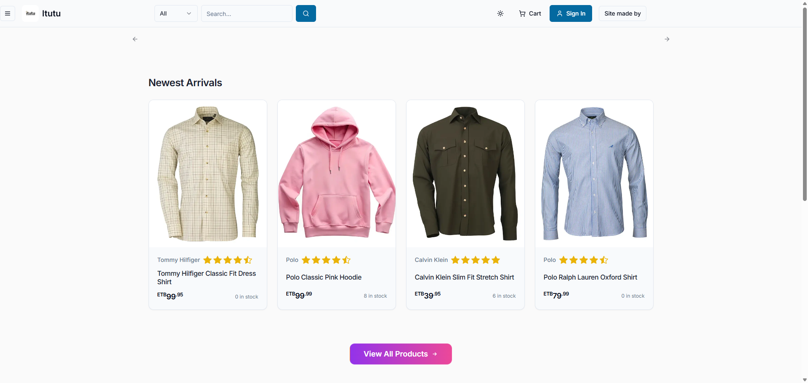
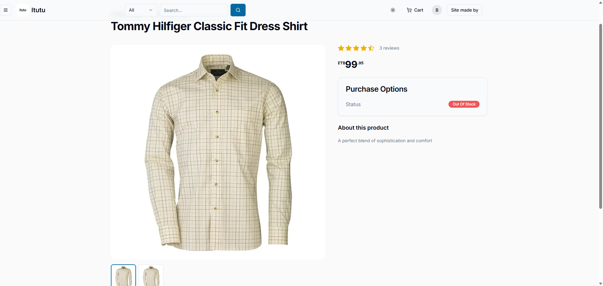
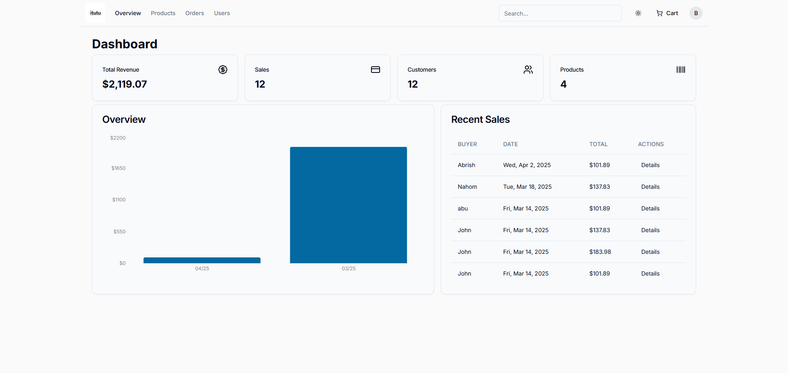
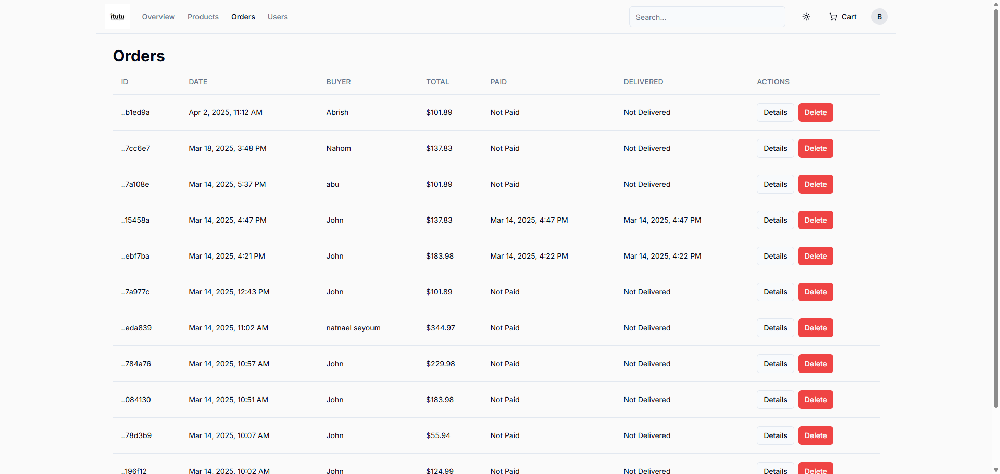

Itutu 🛒

A modern, high-performance e-commerce platform built with Next.js 15, Prisma, and Neon PostgreSQL.

  

    

🚀 Features

A powerful eCommerce platform designed for scalability, speed, and a seamless shopping experience.

🏠 Modern Homepage – Clean, responsive, and SEO-friendly UI

🛍️ Product Listings – Browse, search, and filter products easily

🧾 Product Details – Detailed product descriptions with images

🛒 Shopping Cart & Checkout – Add to cart, manage orders, and checkout

💵 Payment Method – Cash on Delivery (COD) only (online payments coming soon)

📦 Order Management – Track and manage your orders in real-time

👩‍💻 Admin Dashboard – Manage products, users, and orders

🔒 Authentication & Authorization – Secure sign-up and session-based login

📱 Fully Responsive – Optimized for mobile, tablet, and desktop

⚡ Optimized Performance – Uses SSR, ISR, and smart caching for speed

📸 Screenshots

   
 
   

🛠️ Tech Stack
Category	Technologies
Framework	Next.js 15, React 18, TypeScript 5
UI & Styling	TailwindCSS, Radix UI, Lucide Icons, Embla Carousel, Vaul
State & Forms	React Hook Form, Zod, Class Variance Authority
Database	PostgreSQL (Neon), Prisma ORM
Authentication	NextAuth v5 (with Prisma Adapter)
Email & Notifications	React Email, Resend API
Payments	Cash on Delivery (COD) (PayPal integration coming soon)
Image & File Uploads	UploadThing
Charts & Analytics	Recharts
Deployment	Vercel
Testing	Jest, ts-jest
Other Utilities	Query String, Slugify, WS (WebSockets)
⚡ Getting Started

Follow these steps to set up the project locally:

1. Clone the Repository
git clone https://github.com/bekretsion/Itutu.git
cd Itutu

2. Install Dependencies
npm install
# or
yarn install

3. Configure Environment Variables

Create a .env file in the project root and add your variables:

DATABASE_URL=your_database_url
NEXTAUTH_SECRET=your_secret
NEXTAUTH_URL=http://localhost:3000
RESEND_API_KEY=your_resend_key
UPLOADTHING_SECRET=your_uploadthing_secret
UPLOADTHING_APP_ID=your_uploadthing_app_id

4. Run Database Migrations
npx prisma migrate dev

5. Start Development Server
npm run dev

Project will run at: http://localhost:3000

📦 Deployment

This app is deployed on Vercel 🚀
🔗 Live Demo

📌 Roadmap

 💳 Add Stripe & PayPal Online Payments

 🧩 Add Wishlist Feature

 🌙 Implement Dark Mode

 🔍 Improve SEO Optimization

 📊 Advanced Analytics Dashboard

🤝 Contributing

Contributions, issues, and feature requests are always welcome!
Feel free to open an issue or submit a pull request.
